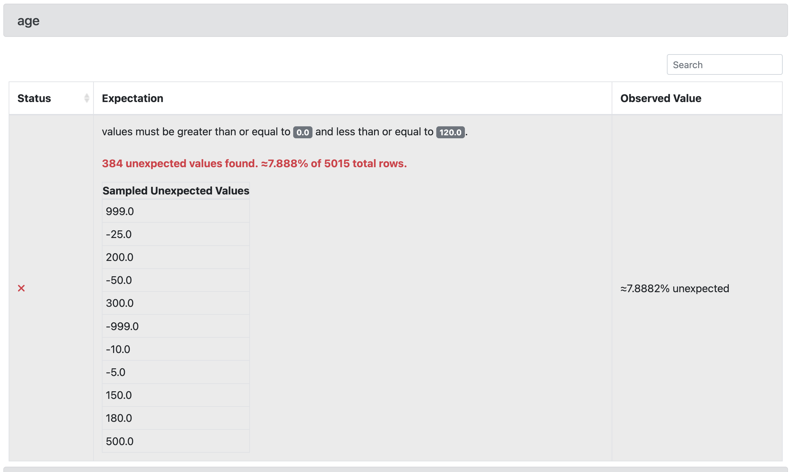
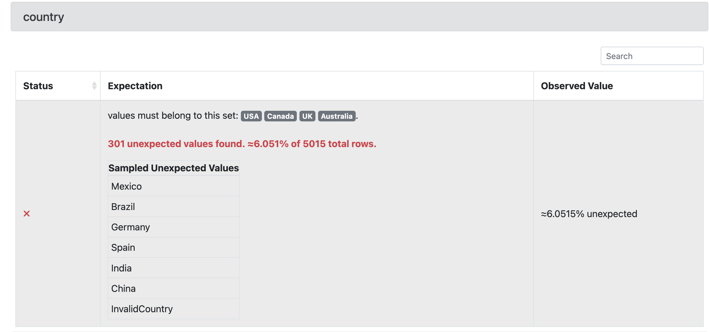
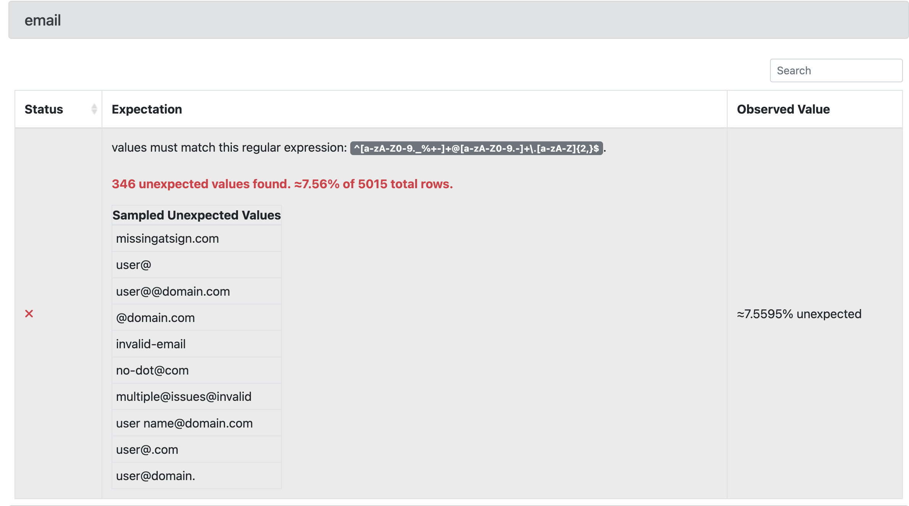
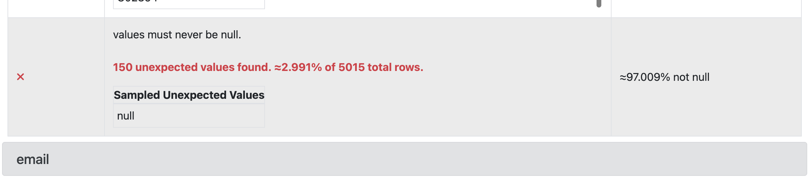
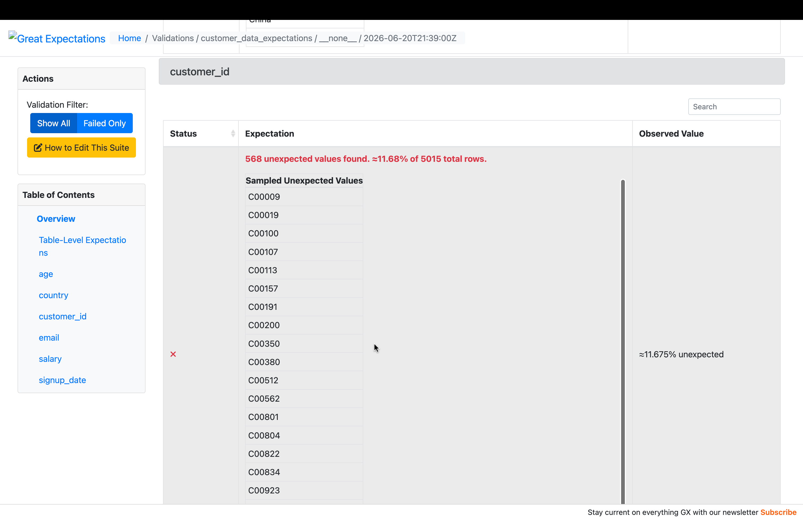
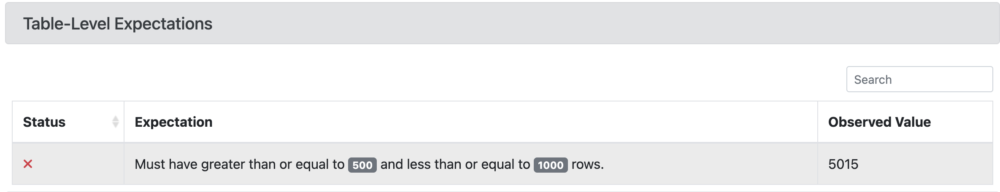
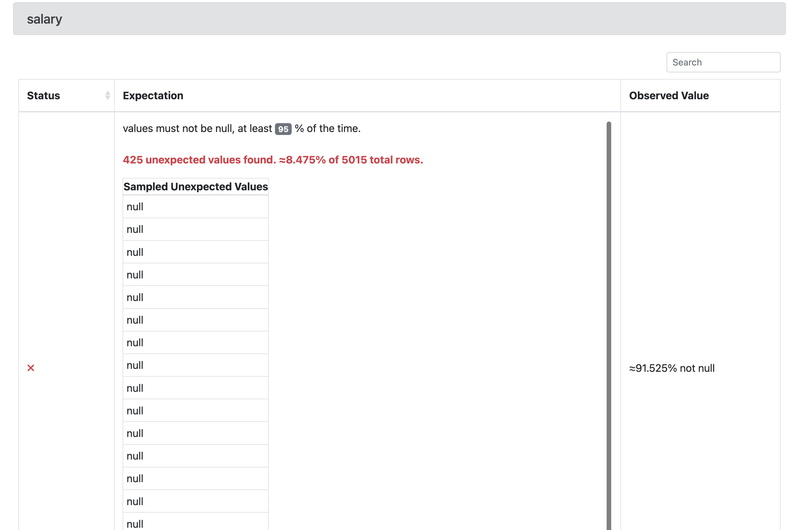
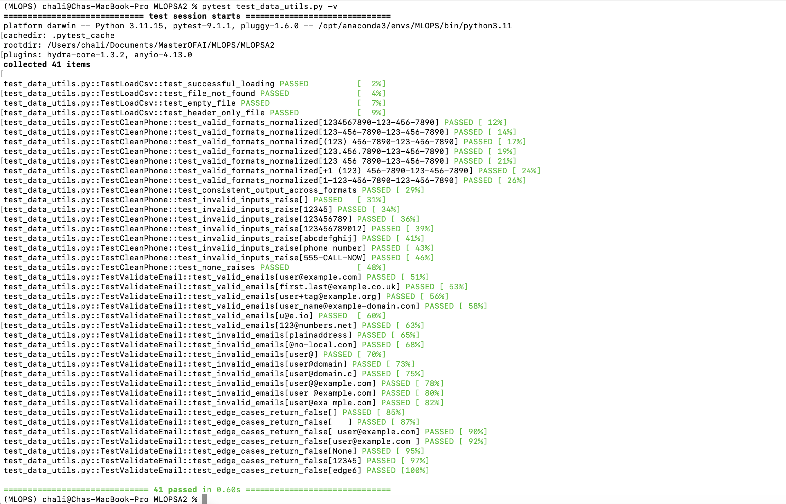

# Great Expectations validation results Screenshot











# Dataset Issues

The dataset contains **5,015 rows**, which satisfies the requirement of more than 1,000 rows. The validation surfaced the following issues:

| Field | Issue | Count | % of Dataset | Example Values |
|-------|-------|-------|--------------|----------------|
| `age` | Unexpected values | 384 | 7.888% | 999, -25, 200 |
| `country` | Unexpected values | 301 | 6.051% | Mexico, Brazil, Germany, Spain, India, China |
| `customer_id` | Unexpected values | 568 | 11.68% | C00009, C00019, C00100 |
| `customer_id` | Null values | 150 | 2.991% | — |
| `email` | Unexpected values | 346 | 7.56% | missingatsign.com, user@, user@@domain.com, @domain.com |
| `salary` | Null values | 425 | 8.475% | — |
| `signup_date` | Day value out of range | — | — | 2023-02-30 |

The `signup_date` issue was resolved during data preprocessing by coercing invalid dates to `NaT`:

```python
df["signup_date"] = pd.to_datetime(df["signup_date"], errors="coerce")
```

# Pytest Execution



# Reflection

The out-of-range numeric values in `age` and `salary` — such as a salary of -5000 or an age of -19 — would do the most damage to a model. Unlike missing values, these errors are still valid numbers, so they pass straight through type checks and into training without raising any flag.

Standardization gets wrecked because the mean and standard deviation are dragged by extremes like ±999, gradient-based models become unstable, distance-based methods such as kNN are dominated by the bogus magnitudes, and linear-model coefficients and tree split points get pulled toward noise. A single `age = 999` row can degrade the scaling of the entire column.